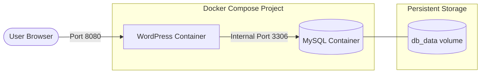

# 19 — Docker Compose

Docker Compose is a tool for defining and running multi-container Docker applications. Instead of running multiple `docker run` commands and creating networks manually, you define your entire application stack in a single YAML file (`docker-compose.yml`) and spin it up with a single command.

---

## The Problem

Imagine an application consisting of:
- A Python Flask backend
- A MySQL database
- An Nginx reverse proxy

To run this manually, you would have to:
1. Create a custom network: `docker network create my_app_net`
2. Start the database: `docker run -d --name db --network my_app_net mysql:5.7`
3. Start the backend: `docker run -d --name web --network my_app_net my-python-app`
4. Start Nginx: `docker run -d -p 80:80 --name proxy --network my_app_net nginx`

This is tedious, prone to errors, and difficult to share with other developers.

---

## The Solution: `docker-compose.yml`

Docker Compose allows you to define all services, networks, and volumes in a `docker-compose.yml` file.

### Example: WordPress + MySQL Application

This is based on the practical example in `examples/docker-compose-wordpress`:



```yaml
version: '3.8'

services:
  db:
    image: mysql:5.7
    restart: always
    environment:
      MYSQL_ROOT_PASSWORD: rootpassword
      MYSQL_DATABASE: wordpress
      MYSQL_USER: wpuser
      MYSQL_PASSWORD: wppassword
    volumes:
      - db_data:/var/lib/mysql

  wordpress:
    image: wordpress:latest
    restart: always
    depends_on:
      - db
    ports:
      - "8080:80"
    environment:
      WORDPRESS_DB_HOST: db
      WORDPRESS_DB_USER: wpuser
      WORDPRESS_DB_PASSWORD: wppassword
      WORDPRESS_DB_NAME: wordpress

volumes:
  db_data:
```

### Key Concepts in the YAML

- **`services`**: Each service is a container (e.g., `db`, `wordpress`).
- **`image`**: The base image to use from Docker Hub.
- **`build`**: Instead of an image, you can tell Compose to build from a local Dockerfile (e.g., `build: .`). Check out `examples/docker-compose-python` for a custom build example.
- **`environment`**: Passes environment variables into the container (equivalent to `-e` in `docker run`).
- **`ports`**: Maps host ports to container ports (`"host_port:container_port"`).
- **`depends_on`**: Ensures services start in the right order (`wordpress` waits for `db`).
- **`volumes`**: Defines named volumes for persistent data so database records survive container restarts.

---

## Essential Docker Compose Commands

You must run these commands in the same directory as your `docker-compose.yml` file!

### Lifecycle
```bash
docker compose up -d         # Build (if necessary), create, and start containers in the background
docker compose down          # Stop and remove containers, networks, and images (volumes remain)
docker compose down -v       # Stop and remove EVERYTHING, including named volumes
docker compose start         # Start existing containers
docker compose stop          # Stop running containers without removing them
docker compose restart       # Restart containers
docker compose pause         # Pause execution of all containers
docker compose unpause       # Resume paused containers
```

### Monitoring & Debugging
```bash
docker compose ps            # List running services in the current compose project
docker compose ls            # List all running compose projects on the host system
docker compose logs          # View logs for all services
docker compose logs -f db    # Follow logs for a specific service (e.g., 'db')
docker compose port web 80   # Print the public port mapped to the service's private port 80
docker compose config        # Validate and view the parsed Compose file
```

### Executing Commands
```bash
docker compose exec db bash  # Open a bash shell inside the 'db' service container
```

### Scaling Services
You can run multiple instances of a single service (if they don't map to a static host port conflict):
```bash
docker compose up -d --scale wordpress=2
docker compose up -d --scale wordpress=1
```

---

## Important Behaviours to Remember

1. **Automatic Networking**: By default, `docker compose up` creates a custom bridge network for the project. Services can communicate with each other using their service names as hostnames (e.g., `WORDPRESS_DB_HOST: db`).
2. **Project Names**: Docker Compose uses the directory name as the project name. If your folder is named `myapp`, the network will be `myapp_default` and the containers will be named `myapp-db-1`, `myapp-wordpress-1`.
3. **Rebuilding Images**: If you change your code or your `Dockerfile`, running `docker compose up` will **not** rebuild the image automatically. You must run `docker compose build` or `docker compose up --build`.


---

*Navigation:*<br>[&larr; Previous Note](18-multistage-builds.md) | [Next Note &rarr;](20-docker-compose-load-balancing.md)
